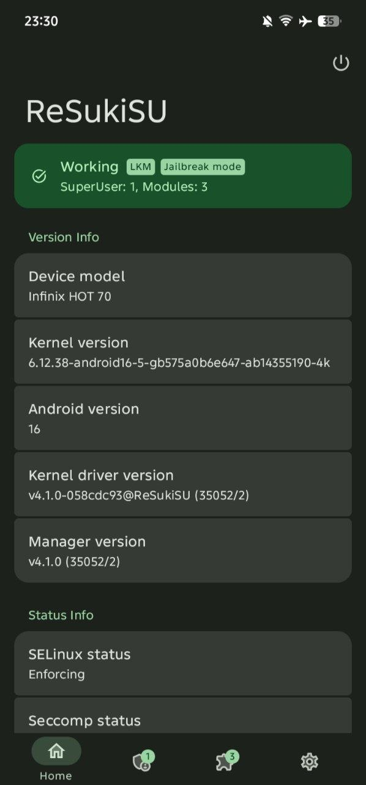

# GhostLock — Locked Bootloader Jailbreak

Kernel exploit for Android devices with locked bootloader. Achieves temporary root + KernelSU installation without unlocking bootloader or modifying boot image. Runtime auto-detection of kernel version with multi-device offset table.

<p align="center">
  
</p>

## Vulnerability

**CVE-2026-43499** — Futex PI (Priority Inheritance) Use-After-Free

Affects Linux kernel 2.6.39 ~ 7.1. Fixed in stable 6.1.175, 6.6.140, 6.12.86. Most Android devices remain unpatched as of September 2026.

The `pselect6` syscall copies `fd_set` data onto the kernel stack. When combined with the futex PI waiter mechanism, a freed stack frame can be reclaimed as an `rt_mutex_waiter` structure. The rb-tree rebalance during PI chain walk then writes controlled values to arbitrary kernel addresses.


## Build

```bash
export NDK_ROOT=/path/to/android-ndk
make
```

## Prerequisites

### ksud (required for KSU installation)

GhostLock provides temporary root. KernelSU installation requires **ksud** which bundles `kernelsu.ko` for each KMI version.

| Method | Steps |
|--------|-------|
| **ReSukiSU APK** (recommended) | Install [ReSukiSU](https://github.com/ReSukiSU/ReSukiSU) or this [fork](https://github.com/JoinChang/ReSukiSU). Bundles `libksud.so`. |
| **CI release** | Download from [ReSukiSU CI](https://github.com/cctv18/ReSukiSU_CI/releases) |

## Setup

```bash
adb shell mkdir -p /data/local/tmp/a/e
adb push ./ghostlock /data/local/tmp/a/e
adb shell chmod 755 /data/local/tmp/a/e
adb shell /data/local/tmp/a/e
```

Run when the Infinix logo (booting) appears and ADB is ready.

## Files

| File | Description |
|------|-------------|
| `src/core/main.c` | Exploit entry, W1/W2, UMH path, bootstrap, root script, SELinux policy fix |
| `src/core/fops.c` | pselect route, PI write, CFI stage, compact waiter support |
| `src/core/util.c` | Heap spray, KernelSnitch, slab drain, payload setup |
| `src/core/pipe_physrw.c` | Pipe buffer physical memory r/w |
| `src/core/umh_root.c` | UMH root via workqueue injection |
| `src/core/miniadb.c` | Mini ADB client (TCP + RSA auth) |
| `src/core/target.h` | Memory layout, struct field defaults (6.12) |
| `src/core/runtime_struct_offsets.h` | Per-device struct field override |
| `src/devices/offsets.h` | Device offset tables + `STRUCT_OFFSETS_*` macros |
| `tools/extract_target.py` | Offset extraction from kallsyms |
| `tools/extract_btf.py` | Struct offset extraction from BTF |
| `tools/kallsyms/` | End-to-end kallsyms recovery workflow |

## Credit

- [GhostLock](https://github.com/JoinChang/ghostlock-oneplus): base source

## License

For authorized security research and educational purposes only.
